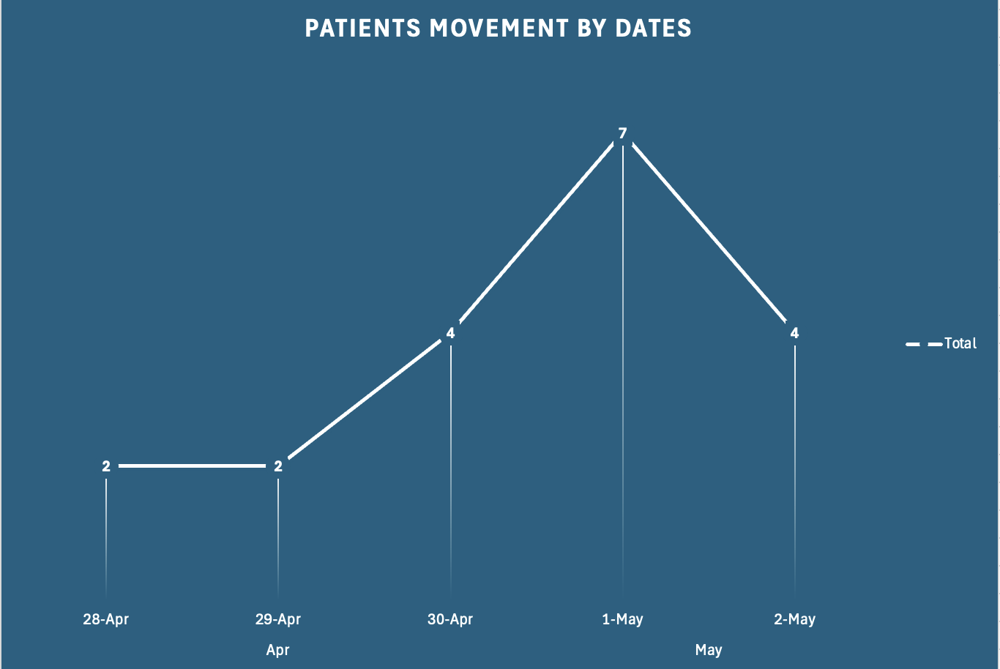
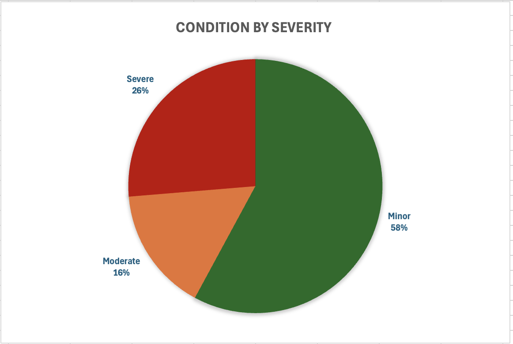
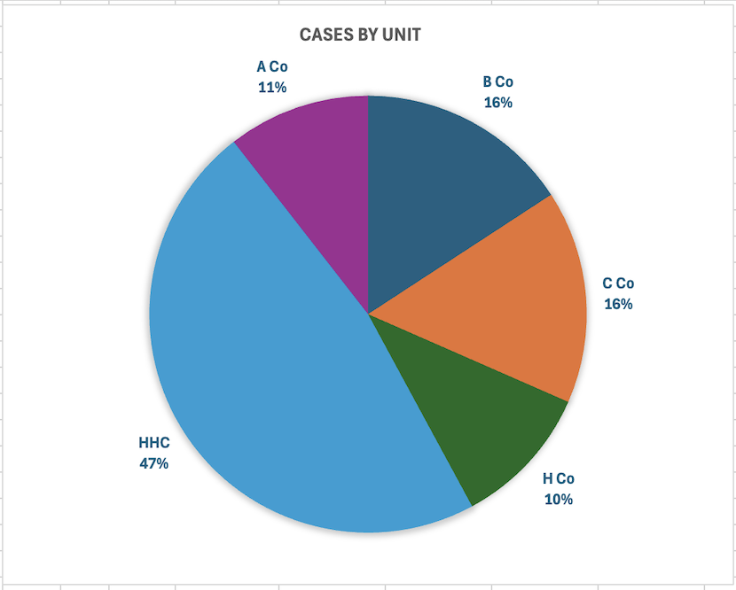
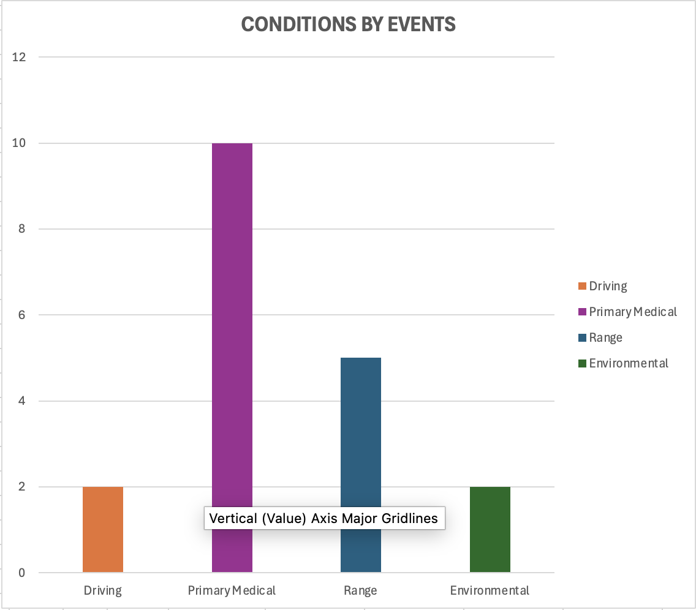

# Patient Movement Tracker Dashboard

## Overview

The Patient Movement Tracker Dashboard is an operational healthcare analytics project designed to support medical readiness reporting, patient movement monitoring, and leadership decision-making. Developed using Microsoft Excel, the dashboard leverages pivot tables, structured datasets, and visual reporting tools to analyze patient movement trends, treatment outcomes, severity classifications, and operational follow-up requirements in a HIPAA-conscious environment.

This project demonstrates practical skills in healthcare operations analytics, dashboard development, data organization, operational reporting, and leadership-focused data visualization.

---

## Project Objective

The objective of this project was to develop a structured operational healthcare dashboard capable of tracking patient movement, monitoring medical readiness trends, and supporting leadership reporting through data-driven visual analytics.

---

## Features

- Patient movement and encounter tracking
- Severity classification and monitoring
- RTD (Return to Duty) and follow-up reporting
- Unit-level readiness summaries
- Treatment location analytics
- Conditions and event/MOA trend analysis
- Pivot table dashboards and visual reporting
- Operational healthcare data organization
- HIPAA-conscious and anonymized data handling

---

## Tools Used

- Microsoft Excel
- Pivot Tables
- Dashboard Reporting
- Operational Analytics
- Data Visualization
- Healthcare Operations Reporting

---

## Pivot Table Analytics

The dashboard visualizations in this project were developed using Microsoft Excel Pivot Tables to summarize and analyze operational healthcare data.

The pivot table analysis included:
- Cases grouped by unit
- Severity classification summaries
- Event/MOA trend analysis
- Patient movement trends over time
- Operational outcome reporting

These pivot tables were used to transform raw operational tracking data into leadership-focused dashboards and visual analytics for healthcare readiness reporting.

---

## Repository Contents

- `PatientMovementTracker.xlsx` — Main Excel dashboard and pivot table workbook
- `screenshots/` — Dashboard visualizations and analytics screenshots
- `README.md` — Project overview and documentation

---

## Dashboard Screenshots

### Patient Movement Trends Over Time
This visualization highlights patient movement activity trends over a multi-day operational period, providing leadership visibility into fluctuations in medical encounters and operational tempo.

---

### Condition Severity Distribution
This chart summarizes the distribution of medical conditions by severity classification, supporting operational awareness, risk assessment, and medical readiness reporting.

---

### Cases by Unit
This dashboard visualization provides a breakdown of medical encounters by unit, enabling leadership to monitor unit-level trends, operational impact, and resource considerations.

---

### Conditions by Event Type
This analysis categorizes medical conditions by event or mechanism of occurrence (MOA), supporting trend identification, incident analysis, and operational healthcare reporting.

---

## Key Skills Demonstrated

- Healthcare Operations Analytics
- Dashboard Development
- Data Standardization
- Leadership Reporting
- Medical Readiness Tracking
- Data Visualization
- Operational Decision Support
- HIPAA-Conscious Data Handling

---

## Disclaimer

All data used in this project has been anonymized and modified for portfolio demonstration purposes only. No personally identifiable information (PII) or protected health information (PHI) is included.